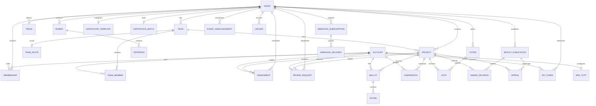

# Data Model

The database is one SQLite file opened through `src/db/open.ts`. It uses 39 strict application tables across 23 forward migrations, foreign keys, WAL mode, integer epoch-millisecond timestamps, and migration hashes.

The authoritative schema is the ordered SQL files in `src/db/migrations/`. Old migration hashes are immutable. Event-scoped foreign keys include `event_id`, preventing cross-event parent references. Ballots and comparisons pin the judge role through generated foreign-key columns. The ledger intentionally has no foreign keys so audit entries survive deletion of their subjects.

The archive tools export 35 application tables as deterministic JSONL plus a manifest containing migration hashes and per-file SHA-256 digests. 3 tables (`api_token`, `webhook_subscription`, `webhook_delivery`) are intentionally omitted from instance archives to isolate deployment-specific bearer credentials, webhook subscriptions, and retry outbox state. Import is restricted to an empty compatible database.

## Public content

Migration `003_content.sql` adds optional tagline, story, thumbnail/video URLs, screenshot URL lines, technology tags and custom answers. Events gain prize descriptions and questions. Existing rows receive empty defaults. Questions/answers are ordered text, not typed dynamic fields. HTTPS media is validated on writes and again when rendered; text is escaped.

## Comments

`comment.created` ledger entries store project, author, time and body. `comment.hidden` references the original sequence and records a moderation reason. Public projection excludes hidden comments and returns the latest 100. There is no separate comment table. Hidden content remains recoverable by administrators and private archive holders; hiding is not erasure.

## Deployment state

Ed25519 keys are files; signed issuance snapshots live in `certificate_batch`, and append-only correction records live in `certificate_correction`. Public result revisions live in `result_publication` with serialized reports and evidence digests. CLI downloads are copies of stored snapshots. Webhook acknowledgements use an atomically written cursor bound to receiver, event and ledger hash, backed by transactional outbox tables in `webhook_subscription` and `webhook_delivery`. Back up these files separately; never publish secrets. Numerical fits are derived in memory and invalidated by ledger head. There is no FTS index.

## Migration 004: permanent certificate snapshots

`certificate_batch(event_id PRIMARY KEY REFERENCES event, issued_at INTEGER, report TEXT CHECK json_valid(report))` stores one immutable signed JSON report per event. The table is STRICT and is included in the 33-table archive. Issuance and its ledger record commit together. GET returns the stored report or an empty report before issuance; POST and CLI retries preserve the original signatures and timestamps. Results must be published before first issuance. Migration 008 adds signed, append-only revocation/supersession records; it does not alter the first batch.

## Migrations 005–009

Migration 005 retains inactive membership and excluded judge evidence and adds frozen `result_publication` revisions. Migration 006 stores judge track eligibility, capacity and recusal. Migration 007 records the last saved draft time separately from creation and submission. Migration 008 adds signed certificate corrections. Migration 009 adds event-specific abuse policy, explicit review state and separate vote discounts; raw vote rows remain intact. Archive export includes all 33 application tables. The ledger and published report snapshot provide different evidence: a hash chain needs a trusted head, while a publication freezes a particular report and input digest.

## Migrations 010–019: enterprise governance, triggers, and anti-abuse

- **Migration 010 (`010_public_result_summaries.sql`)**: Adds `public_summary` to `result_publication` so public history exhibits safe, participant-facing audit summaries while keeping private judge deliberation notes confidential to organizers.
- **Migration 011 (`011_award_decisions.sql`)**: Introduces `award_decision` (`id`, `event_id`, `publication_revision`, `award_key`, `project_id`, `decision_type`, `place`, `public_summary`, `internal_reason`, `actor_id`, `decided_at`). Binds organizer podium and special awards strictly to a frozen result publication revision with support for shared placements.
- **Migration 012 (`012_review_requests.sql`)**: Introduces `review_request` (`id`, `event_id`, `project_id`, `judge_id`, `reason_code`, `internal_reason`, `priority`, `due_at`, `state`, `created_at`, `cancelled_at`). Allows organizers to dispatch targeted extra reviews for coverage gaps, fragility/high-uncertainty tie-breakers, or appeals.
- **Migration 013 (`013_appeals.sql`)**: Introduces `appeal` (`id`, `event_id`, `project_id`, `opened_by`, `publication_revision`, `private_message`, `public_summary`, `state`, `opened_at`, `deadline_at`, `resolved_at`, `internal_reason`, `resolved_by`, `correction_revision`). Implements formal participant appeal adjudication bound to publication revisions.
- **Migration 014 (`014_certificate_template.sql`)**: Introduces `certificate_template` (`event_id`, `presentation`, `logo_data_url`, `updated_at`). Stores customizable SVG certificate presentation layouts and base64 SVG logo assets for first issuance snapshotting.
- **Migration 015 (`015_webhook_outbox.sql`)**: Introduces `webhook_subscription` and transactional `webhook_delivery` (`destination`, `sequence`, `status`, `attempts`, `last_attempt_at`, `delivered_at`, `status_code`, `last_error`). Features an atomic SQLite trigger (`webhook_ledger_outbox after insert on ledger`) guaranteeing that webhook notifications commit synchronously with ledger mutations.
- **Migration 016 (`016_invariant_triggers.sql`)**: Enforces critical database-level business constraints directly in the SQLite engine:
  - `project_submission_window`: Rejects submissions outside `submissions_open_at` and `submissions_close_at`.
  - `ballot_submission_window_insert` / `update`: Rejects rubric ballots outside `judging_open_at` and `judging_close_at`.
  - `comparison_window`: Rejects head-to-head pairwise comparisons outside the judging window.
  - `criterion_scored_insert` / `update` / `delete`: Freezes rubric criteria immutably once scores exist for that version.
  - `score_range_insert` / `update`: Enforces that scored values strictly fall within criterion `[min_score, max_score]`.
  - `assignment_team_conflict`, `ballot_team_conflict`, `comparison_team_conflict`: Enforces conflict-of-interest prevention by aborting any assignment, rubric score, or comparison where a judge reviews their own team's project.
- **Migration 017 (`017_duplicate_triage.sql`)**: Extends `project` with `duplicate_of`, `duplicate_reason`, and `duplicate_decision` (`pending`, `confirmed`, `cleared`) along with a triage index and SQLite foreign-key constraint trigger ensuring duplicate references link only to earlier projects within the same event.
- **Migration 018 (`018_api_tokens.sql`)**: Introduces `api_token` (`id`, `account_id`, `event_id`, `label`, `scope`, `token_hash`, `created_at`, `expires_at`, `revoked_at`). Implements user-managed scoped API access credentials hashed with SHA-256 (`read:projects`, `read:results`, `write:projects`, `write:judging`).
- **Migration 019 (`019_team_invites.sql`)**: Introduces `team_invite` (`event_id`, `team_id`, `code`, `generation`, `updated_at`) with strict 43-character base64url validation. Supports captain-driven invite link regeneration and rotation while keeping high-entropy capability codes isolated from the append-only ledger.

## Migrations 020–023: deadline hardening, announcements, recruitment, and two-factor auth

- **Migration 020 (`020_deadline_hardening_triggers.sql`)**: Installs database-level triggers enforcing that team invite code rotation is restricted to active submission windows (`team_invite_rotate_window`) and quadratic community voting is restricted to active voting windows (`voting_window_active`).
- **Migration 021 (`021_event_announcements.sql`)**: Introduces `event_announcement` (`id`, `event_id`, `author_id`, `title`, `content`, `pinned`, `created_at`, `updated_at`) enabling organizers to broadcast pinned and chronological alert updates to event participants with audit ledger integration.
- **Migration 022 (`022_team_recruitment.sql`)**: Extends `team` with `recruiting` integer flag and `needed_skills` text fields, enabling participant discovery of open teams and skill requirements across the event gallery.
- **Migration 023 (`023_mfa_totp.sql`)**: Introduces `mfa_totp` (`account_id`, `secret`, `enabled`, `created_at`, `verified_at`) delivering zero-dependency RFC 6238 HMAC-SHA1 two-factor authentication and inline SVG QR code enrollment for administrative accounts.

Existing databases gain the empty tables and triggers through the forward migrator. Existing files previously downloaded remain verifiable with their original public key; they are not silently imported as issuance records. For archives made before migration 004, restore with the matching old release, then upgrade that database and re-export. Cross-schema archive import deliberately refuses mismatches. Back up the signing key directory separately from the database.
