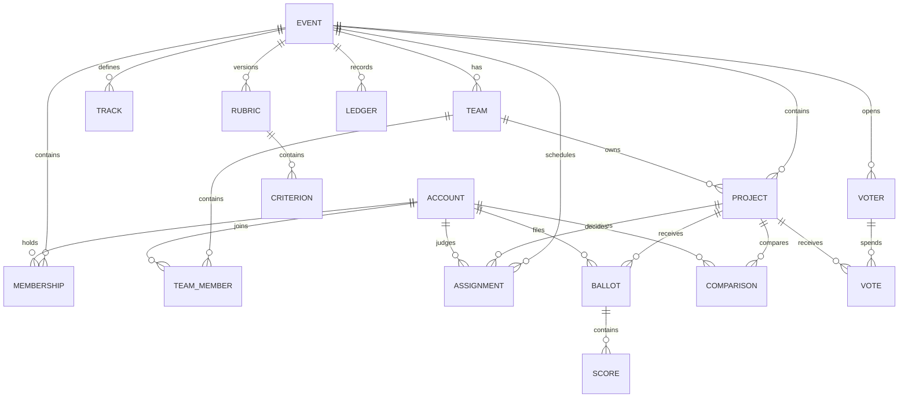

# Data Model

The database is one SQLite file opened through `src/db/open.ts`. It uses strict tables, foreign keys, WAL mode, integer epoch-millisecond timestamps, and migration hashes.

The authoritative schema is the ordered SQL files in `src/db/migrations/`. Old migration hashes are immutable. Event-scoped foreign keys include `event_id`, preventing cross-event parent references. Ballots and comparisons pin the judge role through generated foreign-key columns. The ledger intentionally has no foreign keys so audit entries survive deletion of their subjects.

The archive tools export every application table as deterministic JSONL plus a manifest containing migration hashes and per-file SHA-256 digests. Import is restricted to an empty compatible database.

## Public content

Migration `003_content.sql` adds optional tagline, story, thumbnail/video URLs, screenshot URL lines, technology tags and custom answers. Events gain prize descriptions and questions. Existing rows receive empty defaults. Questions/answers are ordered text, not typed dynamic fields. HTTPS media is validated on writes and again when rendered; text is escaped.

## Comments

`comment.created` ledger entries store project, author, time and body. `comment.hidden` references the original sequence and records a moderation reason. Public projection excludes hidden comments and returns the latest 100. There is no separate comment table. Hidden content remains recoverable by administrators and private archive holders; hiding is not erasure.

## Deployment state

Ed25519 keys are files; signed issuance snapshots live in `certificate_batch`, and append-only correction records live in `certificate_correction`. Public result revisions live in `result_publication` with serialized reports and evidence digests. CLI downloads are copies of stored snapshots. Webhook acknowledgements use an atomically written cursor bound to receiver, event and ledger hash, with a separate status file. Back up these files separately; never publish secrets. Numerical fits are derived in memory and invalidated by ledger head. There is no FTS index.

## Migration 004: permanent certificate snapshots

`certificate_batch(event_id PRIMARY KEY REFERENCES event, issued_at INTEGER, report TEXT CHECK json_valid(report))` stores one immutable signed JSON report per event. The table is STRICT and is included in the 28-table archive. Issuance and its ledger record commit together. GET returns the stored report or an empty report before issuance; POST and CLI retries preserve the original signatures and timestamps. Results must be published before first issuance. Migration 008 adds signed, append-only revocation/supersession records; it does not alter the first batch.

## Migrations 005–009

Migration 005 retains inactive membership and excluded judge evidence and adds frozen `result_publication` revisions. Migration 006 stores judge track eligibility, capacity and recusal. Migration 007 records the last saved draft time separately from creation and submission. Migration 008 adds signed certificate corrections. Migration 009 adds event-specific abuse policy, explicit review state and separate vote discounts; raw vote rows remain intact. Archive export includes all 28 application tables. The ledger and published report snapshot provide different evidence: a hash chain needs a trusted head, while a publication freezes a particular report and input digest.

Existing databases gain the empty table through the forward migrator. Existing files previously downloaded remain verifiable with their original public key; they are not silently imported as issuance records. For archives made before migration 004, restore with the matching old release, then upgrade that database and re-export. Cross-schema archive import deliberately refuses mismatches. Back up the signing key directory separately from the database.
