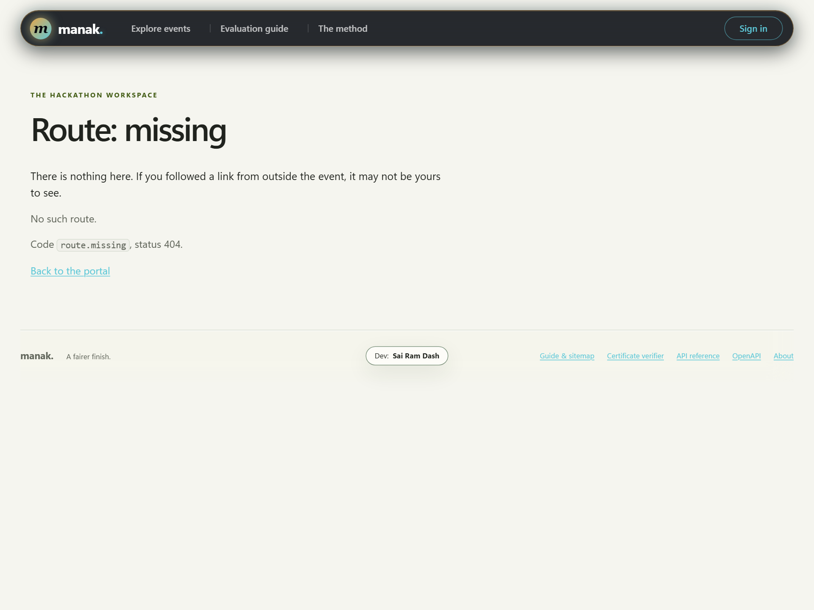

# Feature guide

This guide is for a reviewer who wants to understand the product before reading its code. Each section states the intended outcome, what is implemented now, how a person uses it, and the important boundary. Command names at the end map to the generated browser guide at `/docs` and the OpenAPI document at `/api/openapi.json`.

## People and access

| Person | What they can do |
| --- | --- |
| Visitor | See public events, submitted projects, public comments, and published results. |
| Participant | Join an event and team, create and submit team projects, comment, and vote when permitted. |
| Judge | See eligible assigned projects, save or submit their own scores, and record pairwise decisions. |
| Organizer | Configure their event, invite people, assign judges, inspect private progress and evidence, moderate, and publish results. |
| Founder | Create events. The founder email list is supplied by the operator, not by an event organizer. |
| Server operator | Configure deployment settings, archives, signing keys, mail, and webhooks. This is a host-level responsibility. |

Roles are scoped to one event. A judge invited to one event does not gain access to another. Team ownership and assigned track are checked by the server. Hiding a button is never the access rule. [The threat model](docs/THREAT-MODEL.md) gives the complete boundary and the cases where the server responds with 404 instead of disclosing a private record.

## 1. Sign-in and sessions

**Target:** Let people enter through email without a password database while keeping event permissions separate from identity.

**Current behavior:** A person requests a time-limited link. Opening that link shows a confirmation button; posting the confirmation consumes the token and starts a server-side session. The account page lists live sessions, and sign-out can end one or all sessions. In a local demo, links are printed to the terminal. A configured SMTP server sends them by email.

**Try it:** Open `/signin`, request a link, read the terminal or email, and complete sign-in. Open `/mine` to see events tied to that account.

**Boundary:** Email access is the identity proof. Terminal links are suitable only for a local demo. Use HTTPS and SMTP for a public deployment.

## 2. Event setup and schedule

**Target:** Give an organizer one place to set the schedule and rules that the server will enforce.

**Current behavior:** A configured founder creates an event. Its organizer can set a name, slug, timezone, submission and judging windows, judging mode, track settings, prize text, and custom question text. Event pages show the current phase and upcoming boundary. The server checks deadlines on writes, so an old form cannot submit after a window closes. An archived event cannot be changed.

**Try it:** Sign in as `rosa@example.com` in the demo. Open the event and its organizer controls. Compare the visible phase with its configured dates.

**Boundary:** Questions and prize descriptions are text, not a form builder or award engine. Time is stored as integer UTC milliseconds and shown in the event timezone. See [DATA-MODEL.md](DATA-MODEL.md).

## 3. Invitations, tracks, and teams

**Target:** Bring participants and judges into the right event and prevent a judge from reviewing outside their scope.

**Current behavior:** An organizer sends role invitations. Track-limited judges are associated with their eligible scope. Organizers create tracks. Participants can view teams and join with an invitation. A project belongs to a team, and team membership is checked when its details change.

**Try it:** Use the event's invitations and teams pages. Sign in under two different accounts and check that one team's edit controls are unavailable to the other.

**Boundary:** Membership and track checks happen in the command layer. A direct API call receives the same restrictions as a browser form.

## 4. Project drafts, submission, and gallery

**Target:** Let teams prepare a real project entry, then expose submitted work for review and discovery.

**Current behavior:** A team creates and edits a draft during the submission window. Fields include title, summary, tagline, long story, track, technology tags, thumbnail URL, screenshot URLs, video URL, repository URL, live URL, and answers to organizer questions. Submission changes the project state. A team can withdraw under the applicable rules. An organizer can withdraw or disqualify a project and state the reason. Public pages show eligible submitted work. Search uses case-insensitive literal matching with filters, not full-text indexing.

**Try it:** Open an event's project gallery. Use search and track filters, then open one project to see its story, media, tags, links, answers, and comments. As a participant, create a draft and submit it before the deadline.

**Boundary:** Images and video are validated external HTTPS links. Manak does not store uploads or promise that a remote host stays available. A withdrawn or disqualified entry does not silently stay in judging.

## 5. Comments and moderation

**Target:** Allow discussion while making moderation visible in the audit record.

**Current behavior:** Signed-in users can comment on submitted projects. An organizer can hide a comment with a reason. The public project page excludes hidden comments. The original comment and moderation action remain in the event ledger; hiding is not data erasure.

**Try it:** Add a comment to a submitted project, then use an organizer account to hide it and inspect the audit view.

**Boundary:** The public projection returns the latest 100 visible comments. A private archive holder can still recover hidden content.

## 6. Rubrics and judge assignment

**Target:** Make scoring criteria explicit before judging starts and distribute work without known conflicts.

**Current behavior:** An organizer creates a weighted rubric with criteria and publishes a version. Judges see the published version used by their ballots. The assignment command balances review load while honoring event, track, ownership, and conflict checks. The organizer can inspect judge participation and coverage.

**Try it:** Open the event rubric, then the organizer's assignment controls. Sign in as a judge and compare the assigned queue with the organizer view.

**Boundary:** Assignment improves coverage within the known constraints. It does not prove that every human conflict has been disclosed. Rubric versions remain attached to existing ballots.

## 7. Rubric ballots and pairwise decisions

**Target:** Give judges a focused queue and let them preserve work before final submission.

**Current behavior:** A judge sees only their eligible assignments. The queue puts drafts first and links back to them. Score controls show the published criteria and allow draft or final save. Pairwise mode offers a scheduled pair; a judge chooses a stronger project or skips when permitted. Decisions are recorded for audit. One judge cannot read another judge's private scores.

**Try it:** Sign in as a demo judge, open the queue, save a draft, return to the queue, then submit it. Try the comparison page if the event enables pairwise judging.

**Boundary:** A skipped comparison is recorded but does not count as a decisive win. Saving a draft does not publish a score.

## 8. Normalization and ranking

**Target:** Reduce the effect of judges who score consistently high or low, and show when evidence is too thin to support a firm order.

**Current behavior:** Weighted rubric scores are normalized across judges using a project effect and judge offset model. Judge scale is shrunk and bounded; low-information reviewers receive less influence. Pairwise wins are fitted with a separate regularized Bradley-Terry model. Results show rubric and pairwise standings separately. Published intervals and tiers describe uncertainty rather than a guaranteed winner.

**Try it:** Read [JUDGING.md](JUDGING.md), then compare the organizer dashboard with the published results. Run the normalization proof to reproduce the synthetic checks.

**Boundary:** Overlap among judges is needed to estimate relative judge effects. A project with no comparisons has prior-based strength, not observed support. The two ranking modes are not silently blended into one public order.

## 9. Organizer dashboard and evidence lab

**Target:** Show what the organizer should fix before publication, with deeper methods available when needed.

**Current behavior:** The dashboard reports reviewer progress, coverage, disconnected review panels, fit convergence, uncertainty, and finalist review guidance. Its optional evidence lab runs with `?lab=true`. It reports cycles in pairwise decisions, reviewer distribution distance, vote-pattern signals, and comparison suggestions based on the current graph's information. Results are cached by database, event, ledger revision, and analysis type; audited changes invalidate the cache.

**Try it:** As an organizer, open the dashboard and then select the evidence lab. The JSON form is under the same authenticated dashboard API. Try it as a judge to see the access boundary.

**Boundary:** These are advisory diagnostics. They do not edit ballots, remove votes, assign awards, or prove dishonesty. The lab has size limits and reports unavailable or truncated analyses. See [JUDGING.md](JUDGING.md) for formulas and interpretation.

## 10. Community voting

**Target:** Let the community support projects without exposing live totals or making ballot position fixed.

**Current behavior:** An organizer starts a voting window. A voter receives a project ballot in shuffled order and spends a fixed quadratic credit budget. Access can be open or tied to a verified account under the configured mode. Vote results stay hidden from non-organizers during the active window. Rate limits and duplicate fingerprints support review; an organizer can inspect the signals.

**Try it:** Open the event ballot during its voting window. Cast credits and check that a public visitor cannot see live totals.

**Boundary:** Account-based email voting is not a separate email-only access mode. Shared networks can create innocent fingerprint matches. Signals are not automatic fraud verdicts.

## 11. Results and publication

**Target:** Keep private work private until the event is ready, then publish an understandable result.

**Current behavior:** The organizer sees readiness and a confidence view. Publication freezes a versioned report, evidence digest and ledger head in one transaction. Public visitors see that frozen revision only after the server-side gates allow it. Corrections append a revision with a reason and retain the old report. Rubric scores, pairwise ranking, and community voting remain distinct views so different kinds of evidence are not mistaken for one score.

**Try it:** Compare the results page as an organizer and as a visitor before and after publication in a disposable demo database.

**Boundary:** Readiness is decision support. An organizer still needs an explicit prize policy, especially for hybrid or pairwise events.

## 13. Certificate Studio, Vector Art, and Offline Verification

   
  <i>Certificate Studio (/events/:slug/certificates/studio) with live WYSIWYG preview, guilloche border, custom signatories, and official logo binding.</i>

**Target:** Give organizers complete creative control over event certificates with mathematically bound, offline-verifiable cryptographic guarantees.

**Current behavior:** 
- **Template Designer**: Organizers configure certificate heading, custom body copy, footer, signatories, and upload an official event logo (PNG, JPEG, WebP, SVG under 96 KiB with strict byte-level signature verification).
- **Standalone SVG Generation**: `GET /events/:slug/certificates/:serial.svg` serves crisp, print-ready vector awards with security rosettes, guilloche frames, and embedded QR verification coordinates.
- **Offline Cryptographic Verifier (`/verify`)**: Award records bind the event slug, issue timestamp, recipient, placement, and SHA-256 logo digest into an Ed25519 digitally signed v3 presentation payload. Anyone can verify the award directly in their browser using the WebCrypto API without querying or trusting the server.

   
  <i>Public Offline Verifier (/verify) cryptographically checking Ed25519 signatures and verifying logo digest integrity.</i>

**Try it:** As organizer `rosa@example.com`, open `/events/sample-hack-2026/certificates/studio`. Adjust the heading or signatory, upload a badge, and observe the live preview. Download the SVG award, then open `/verify` to test offline verification.

**Boundary:** Certificate templates are scoped per event. Issuing certificates commits the current template and logo digest into immutable signed payloads; subsequent template updates do not alter previously signed awards.

## 14. Repeated Project Title Collision Detection (NFC Unicode Normalization)

**Target:** Prevent confusion, duplicate project entries, and unintentional collision in large hackathon rosters before judging commences.

**Current behavior:** During readiness analysis (`/events/:slug/dashboard` and `/events/:slug/action-plan`), the readiness audit engine scans all active project titles. It applies Unicode NFC normalization, trims whitespace, and folds case to group potentially identical titles across teams. The dashboard warns organizers with an actionable alert, linking directly to the flagged submissions for immediate triage.

   
  <i>Action Plan showing high-priority readiness alerts, including repeated project title warnings and coverage bottlenecks.</i>

**Try it:** Create two projects with similar titles (e.g. `Quantum Leap` and `quantum leap`), submit both, and inspect the Organizer Dashboard or Action Plan.

**Boundary:** Warning is non-blocking to prevent disruption during hectic submission sprints, but provides conspicuous audit guidance to organizers.

## 15. 3D CSS Hero Globe & Accessibility Controls

**Target:** Add a clean, lightweight visual element to the landing page without external libraries or WebGL.

**Current behavior:** Built entirely with pure CSS 3D transforms and SVG vector geometry (no Three.js, WebGL, or runtime dependencies). Features a rotating globe, longitude/latitude rings, and orbiting markers. Includes a pause toggle (`#pause-orbit`) and automatically respects OS accessibility settings via `@media (prefers-reduced-motion: reduce)`.

---

## Command inventory

The **82 registered operations** are grouped below. `/docs` supplies the current method, path, fields, and role rule for each one. Generated [OpenAPI](openapi.json) documents the full machine-checked specification.

| Area | Operations |
| --- | --- |
| Sign-in | `auth.signin`, `auth.request`, `auth.link`, `auth.session`, `auth.whoami`, `auth.signout` |
| Events | `events.list`, `events.show`, `events.create`, `events.update`, `events.mine`, `events.invite`, `events.judges` |
| Teams and tracks | `tracks.create`, `teams.list`, `teams.join` |
| Projects | `projects.list`, `projects.show`, `projects.create`, `projects.update`, `projects.submit`, `projects.withdraw`, `projects.pull`, `projects.disqualify` |
| Comments | `comments.add`, `comments.hide` |
| Rubrics | `rubrics.show`, `rubrics.create`, `rubrics.publish` |
| Judge work | `judging.queue`, `ballots.save`, `duels.next`, `duels.decide`, `assignments.preview`, `assignments.draw`, `judges.roster`, `judges.configure`, `judges.recusal`, `reviews.requests`, `reviews.request`, `reviews.cancel` |
| Results, evidence and awards | `results.show`, `results.confidence`, `events.dashboard`, `results.preflight`, `results.evidence_packet`, `results.history`, `results.publish`, `results.unpublish`, `awards.list`, `awards.decide`, `results.certificates`, `results.certificate_studio`, `results.certificate_template`, `results.public_certificate` |
| Community voting | `votes.start`, `votes.cast`, `votes.results`, `votes.ballot` |
| Export | `exports.download` |
| System | `system.home`, `system.healthz`, `system.docs`, `system.openapi`, `system.capabilities`, `system.about`, `system.guide` |
