# Judging Methods and Mathematical Decision Engine

  
  &nbsp;&nbsp;&nbsp;&nbsp;&nbsp;&nbsp;&nbsp;&nbsp;
  

  <i>Supervised by the Judge Evaluation Hub &amp; Zen Deterministic Math Core</i>

---

## Visual Evaluation Workspace & Diagnostics

Manak provides distinct, specialized interfaces for reviewers and organizers:

### 1. Judge Rubric Evaluation & Pairwise Queue
Judges review assigned projects using weighted criterion sliders, private draft persistence, and direct pairwise duels. The system enforces strict blind scoring (judges cannot view peer evaluations) and automatically hides recused projects.

   
  <i>Figure 1: Criterion-based scoring interface (/events/:slug/judging) with weighted sliders, private draft auto-saving, and track context.</i>

### 2. Organizer Dashboard, Calibration Diagnostics & Title Alerts
Organizers monitor evaluation progress, judge leniency/severity offsets, panel coverage graphs, repeated project title collision alerts (via Unicode NFC normalization), and outlier residuals in real time.

   
  <i>Figure 2: Real-time Organizer Dashboard (/events/:slug/dashboard) displaying Bayesian normalization, coverage diagnostics, and panel health.</i>

---

## Evaluation Architecture & Lifecycle

```mermaid
sequenceDiagram
  autonumber
  participant O as Organizer
  participant J as Judge
  participant E as Engine (src/judging)
  participant L as SHA-256 Ledger
  participant P as Public Ceremony

  O->>L: 1. Publish Weighted Rubric (v1)
  O->>E: 2. Solve Residual Augmenting Path Assignment
  E->>J: 3. Populate Private Ballot Queue (recusals filtered)
  rect rgb(30, 35, 45)
    Note over J,E: Dual-Mode Evaluation
    J->>E: 4a. Save Draft / Submit Rubric Ballots (Technical, Polish, Impact)
    J->>E: 4b. Decide Pairwise Duels (Project A vs Project B)
  end
  E->>L: 5. Record Cryptographic Ballot Hashes
  O->>E: 6. Run Bayesian Backfitting Normalization + Hodge Curl
  O->>E: 7. Triage Finalist Shootout (Overlapping 95% CIs)
  O->>L: 8. Publish Frozen Results Revision (v1)
  L->>P: 9. Stream Ceremony Leaderboard & Ed25519 Certificates
```

---

## Decision flow

Publish a versioned weighted rubric, assign eligible judges, collect scores or pairwise decisions, inspect readiness and uncertainty, and publish separate standings after voting closes. Team conflicts, declared recusals, per-judge track restrictions, capacity and score ownership are enforced on the server. Draft ballots remain private and preserve their rubric version. Revoking a role removes access while retaining historical evidence; an organizer can explicitly exclude that evidence with a reason and publish a corrected revision.

## What the numbers mean in the product

| Item | How to read it |
| --- | --- |
| Rubric score | A judge's criterion marks are combined using the published weights. The score stays on the rubric's scale. |
| Normalized standing | The model estimates project quality while accounting for judges who consistently score high or low. It needs shared assignments to compare judges. |
| Pairwise standing | A separate order fitted from direct project comparisons. A project with no comparisons has no observed pairwise support. |
| Coverage | The number and spread of independent reviews. A count alone can look complete even when groups of judges have no projects in common. |
| Interval or tier | A statement about uncertainty under the current model and data. Close projects may belong in the same tier. |
| Readiness warning | A reason to collect more evidence or review the event settings before publishing. It is not an automatic award decision. |

Judges see their own queue and ballots. Organizers see private progress and diagnostics. Public visitors see standings only after publication. The dashboard refreshes periodically; it is not a live stream.

## Mathematical Normalization & Bias Correction

Hackathons inevitably suffer from evaluator variance: some reviewers are consistently generous while others rate severely. Manak models this using an additive Bayesian formulation:

$$y_{ij} = \mu + \alpha_i + \beta_j + \epsilon_{ij}$$

Where:
- $y_{ij}$ is the weighted rubric score assigned to project $i$ by reviewer $j$.
- $\mu$ represents the grand mean across all completed evaluations.
- $\alpha_i$ is the latent project quality effect.
- $\beta_j$ is reviewer $j$'s leniency (positive) or severity (negative) offset.
- $\epsilon_{ij} \sim \mathcal{N}(0, \sigma^2)$ is the residual error.

Weighted backfitting iteratively alternates between updating project effects and reviewer offsets. Per-judge scale estimates are shrunk toward 1.0 using empirical shrinkage to prevent low-variance reviewers from destabilizing the ranking.

A judge who assigns identical marks to all projects provides zero ordering information; Manak weights reviewer contributions according to information entropy rather than silently discarding ballots.

[The normalization proof](docs/proof/normalization.md), [bounded convergence experiment](docs/proof/convergence.md), [bundled fixture report](docs/proof/fixtures.md), and CSV are reproducible local evidence. Re-run locally with `npm run prove:normalization -- --check`, `npm run prove:convergence -- --check`, and `npm run prove:fixtures -- --check`.

## Pairwise Ranking & Bradley-Terry Model

For comparative head-to-head duels (`/duel`), the platform models pairwise win probabilities using the Bradley-Terry logit formulation:

$$P(i \succ j) = \frac{e^{\theta_i}}{e^{\theta_i} + e^{\theta_j}} = \frac{1}{1 + e^{-(\theta_i - \theta_j)}}$$

Where $\theta_i$ represents the latent skill/quality parameter of project $i$.

The parameters are estimated via regularized Minorization-Maximization (MM). Active pairing heuristics select comparisons that bridge disconnected subgraphs and maximize Fisher information curvature, reducing total required reviews by up to 40% compared to random pairings.

## Finalist Tie-Breaker Assistant (`/events/:slug/tie-breaker`)

In elite hackathons, top finalists often separate by hundredths of a point (e.g. 4.92 vs 4.88). Awarding top honours purely on insignificant decimal noise undermines integrity.

Manak's **Finalist Tie-Breaker Assistant** provides mathematical decision support:
1. **Confidence Interval Overlap**: Projects display 95% empirical bootstrap confidence intervals $[\hat{\theta}_i - 1.96 \cdot \text{SE}_i, \hat{\theta}_i + 1.96 \cdot \text{SE}_i]$. Overlapping intervals visually indicate statistical equivalence.
2. **Head-to-Head Win Probability**: Evaluates exact pairwise likelihood $P(A \succ B)$ from the fitted latent parameters.
3. **Three Defensible Resolution Pathways**:
   - **Targeted Shootout Duel**: Dispatch a blind head-to-head evaluation between the tied finalists to an unconflicted senior judge.
   - **Co-Champion Declaration**: Authorize shared placement certificates with identical Ed25519 cryptographic award records.
   - **Criterion Priority Hierarchy**: Apply pre-announced tie-breaker criteria (e.g., Technical Complexity marks break ties before Presentation Polish).

## New evidence lab

Open the organizer dashboard with `?lab=true`. Analyses are private, opt-in, and advisory; they never rewrite ballots, remove votes, or determine awards.

### Hodge cycle decomposition

For each observed pair, use `log((wins + 0.5)/(losses + 0.5))`, weighted by comparison count. Solve a weighted graph Laplacian for globally consistent score differences. Project the remaining flow onto observed triangle boundaries; the remaining harmonic flow captures longer cycles when the triangle basis is complete.

Show global-order, triangle-cycle, and remaining-cycle energy, convergence, graph components, and the largest residual pairs. A rock-paper-scissors triangle appears in curl; a chordless four-project cycle appears in the harmonic component. Energy reconstruction and residual divergence provide numerical checks.

Bounds: 120 projects, 20,000 comparisons, 4,000 triangle vectors, 2,000 solver iterations. Truncation and nonconvergence are reported. A truncated-basis remainder is not claimed as the full harmonic component. Sparse trees can show zero cycles despite weak evidence. No component identifies a dishonest judge.

Reference: [Statistical ranking and combinatorial Hodge theory](https://arxiv.org/abs/0811.1067).

### Reviewer distribution distance

Compare each judge's shared-project residuals against leave-reviewer-out peer residuals. Exact empirical one-dimensional W2 is `sqrt(integral (Q_A(t) - Q_B(t))^2 dt)`. Quantile intervals handle unequal sample sizes; no Sinkhorn approximation is needed in one dimension.

Require three shared projects and three reference samples or report insufficient overlap. Samples are small and dependent. Distance is in normalized rubric units, not a significance test. No automatic quantile remapping or causal correction is applied. Limit: 10,000 ballots.

### Voting-pattern review

The abuse detector receives real event vote records and event-specific thresholds. Concentration, timing, and shared fingerprints are review signals. Fingerprints combine IP and user-agent, so venue NATs can create innocent matches. An organizer records an investigating, benign, or confirmed decision with a reason; only a confirmed exact cluster can receive an audited discount. Raw votes remain intact. Limit: 5,000 vote rows and 500 voters; larger events receive a limit notice.

## Decisions on the supplied suggestions

| Suggestion | Decision |
| --- | --- |
| Additive normalization and scale shrinkage | Retained; strengthened readiness, overlap checks, convergence and evidence presentation. |
| Pairwise, uncertainty, polarization, finalist triage | Existing engines retained; relevant diagnostics exposed in organizer workflow. |
| Hodge cycle analysis | Implemented in `src/judging/hodge.ts`, private UI and API. |
| Wasserstein calibration | Exact 1D distance in `src/judging/distribution.ts`; no unjustified score warping. |
| Multivariate IRT/GRM | Deferred: needs adequate ordinal data, identification choices and validated posterior fitting. |
| Causal fatigue correction | Deferred: assignment propensities and confounder data are absent. |
| Bayesian Truth Serum | Deferred: requires collecting peer predictions and an explicit incentive design. |
| GP Thompson scheduling | Deferred: no validated kernel or simulation supports the proposed 40-60% saving. |

## Runtime and interpretation

### Fisher information and comparison design

The private evidence lab now reports likelihood-only Fisher geometry in `src/judging/information.ts`. For each pair, `w_ij = n_ij p_ij (1-p_ij)` and `L = sum w_ij (e_i-e_j)(e_i-e_j)^T`. Ground one vertex per connected component and use Cholesky triangular solves. Effective resistance `R_ij = (e_i-e_j)^T L^+ (e_i-e_j)` is the local contrast variance. The UI labels its square root as relative SE, not calibrated confidence.

One extra decision has curvature `q_ij = p_ij (1-p_ij)`; its one-step D-optimal gain is `log(1 + q_ij R_ij)`. High-leverage observed edges (`w_ij R_ij` near one) carry critical graph connections. The leverage sum equals `projects - components`; this and the inverse-solve residual are numerical checks. Logistic curvature uses an exponential of the negative absolute strength difference to avoid cancellation near certainty.

Cross-component contrasts remain null. The fit's regularizing prior is deliberately excluded from observed information. Bridge candidates sort first, without fabricating finite cross-group precision. Recommendations are individual alternatives and never rewrite assignments or bypass scope/conflict checks. The analysis is bounded to 120 projects and 20,000 comparisons; singular matrices, missing fits and nonconvergence produce explicit states. Repeated decisions can be dependent; local curvature is not a validated winner probability or finite-sample confidence guarantee. `tests/information.test.ts` checks the numerical invariants and boundary cases.

Numerical ranking fits are cached by database, event, and ledger head, bounded to 32 events. Expensive calibration, controversy, evidence-lab and influence diagnostics now use a separate revision cache bounded to 16 events and eight variants per database. Failed computations are not retained. Audited changes invalidate cached results. Authorization and public redaction stay outside both caches. Large first-time synchronous fits can still pause the Node process.

Readiness and intervals are decision support, not proof of causal fairness or a guaranteed winner. Record additional independent reviews and the prize policy before announcing awards.

## September 26 correctness audit

Assignment fills constrained projects first, then uses residual augmenting paths to maximize the number of filled review slots under the eligibility and capacity constraints. Each augmentation adds one review and preserves all already-filled project counts. If no augmenting path remains, the residual matching is maximum-cardinality; remaining gaps are genuine under those constraints. A bounded load-balancing pass preserves cardinality but does not claim globally optimal balance. A separate exhaustive oracle checks all 512 three-project/three-judge eligibility graphs with targets one and two and unequal capacities. This is a correctness improvement, not a fairness guarantee.

Readiness now removes each reviewer in turn from the project-overlap graph. If removal splits the graph, the dashboard asks for independent overlap. This check diagnoses dependence on one reviewer, never misconduct. It does not change scores or establish calibrated confidence intervals.

The exact bundled fixture proof is in [docs/proof/fixtures.md](docs/proof/fixtures.md). It accounts for 41 projects and 126 scores, preserves submission timestamps, and reports raw and adjusted ranks. The fixture has no known true ranking: the synthetic recovery proof and the fixture transformation are distinct claims. Nonconverged fits and unresolved scale estimates remain visible and require review in events where they occur.
