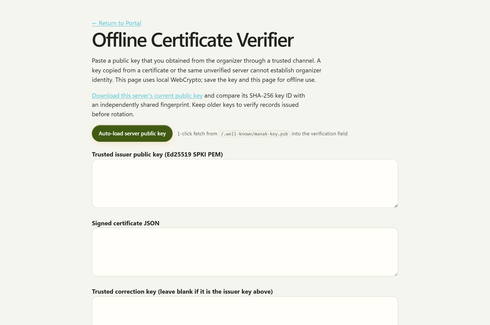
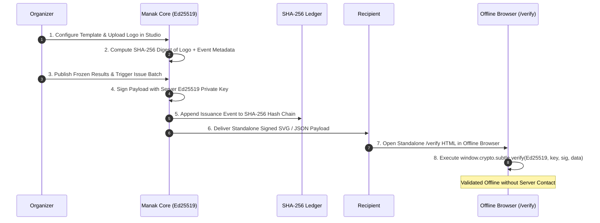

# Production Operations & Deployment Guide

<p align="center">
  
  &nbsp;&nbsp;&nbsp;&nbsp;&nbsp;&nbsp;&nbsp;&nbsp;
  
</p>
<p align="center">
  <i>Maintained by the Tamper-Evident Cryptographic Verifier &amp; Organizer Command</i>
</p>

---

## Visual Operations: Certificate Studio & Public Verification

Manak pairs back-office operational controls with high-fidelity certificate generation and trustless offline verification:

### 1. Certificate Studio & Custom Vector Art
Organizers design visual certificates with real-time SVG previews, mathematical guilloche vector borders, customizable titles/signatories, and strict image asset binding (logos verified under 96 KiB and bound by SHA-256 digest).

<p align="center">
  <br>
  <i>Figure 1: Certificate Studio (/events/:slug/certificates/studio) with real-time vector layout editor and standalone SVG download.</i>
</p>

### 2. Client-Side Offline WebCrypto Verification
Recipients and employers verify certificates offline in any modern browser without trusting the Manak server. The verification page runs purely client-side using native WebCrypto Ed25519 routines.

<p align="center">
  <br>
  <i>Figure 2: Public verification terminal (/verify) parsing signed JSON payloads and validating Ed25519 signatures against the pinned issuer public key.</i>
</p>

---

## Cryptographic Award Verification Lifecycle



---

## Production Deployment & Hosting

### Railway Deployment (Zero-Downtime, Persistent SQLite)

Manak is engineered to run in a single container with a mounted persistent volume for the SQLite database and Ed25519 cryptographic keypair:

```sh
# Deploy directly to Railway production environment
railway up -s manak -e production
```

Recommended Environment Configuration:
- `MANAK_DATABASE=/data/manak.db` (Mapped to persistent Railway Volume at `/data`)
- `MANAK_KEY_DIR=/data/keys` (Persistent Ed25519 key storage)
- `MANAK_PUBLIC_ORIGIN=https://manak.up.railway.app`
- `MANAK_PORT=8080`
- `MANAK_FOUNDERS=organizer@example.com`
- `MANAK_RESEND_API_KEY=re_...` (Optional transactional mail delivery)

### Health Check & Ledger Integrity Inspection

Inspect container health, SQLite connectivity, and SHA-256 ledger integrity via `/api/healthz`:

```sh
curl -s https://manak.up.railway.app/api/healthz | jq .
```

Expected Response:
```json
{
  "status": "ok",
  "database": "connected",
  "ledger_head": "019234a5-...",
  "operations": 82,
  "dependencies": 0
}
```

---

## Boot

`npm run start:demo` runs without package installation on Node 22.18+; local validation used Node 24. Defaults: `data/demo.db`, founder `rosa@example.com`, seed once. Set `MANAK_DEMO=false` to disable seeding, or use `npm start` for an empty production deployment.

Set `MANAK_DATABASE`, `MANAK_FOUNDERS`, `MANAK_PUBLIC_ORIGIN`, and optionally `MANAK_PORT`. By default, sign-in links are printed to stdout; log readers can use them. Optional SMTP uses `MANAK_SMTP_HOST`, `MANAK_SMTP_FROM`, encryption/port and credentials. A hosted deployment may supply a separate mail adapter. Enable proxy trust only behind your controlled proxy and use HTTPS in production. `npm start -- --help` lists settings.

## Backup

Use the archive CLI for consistent snapshots. `npm run archive:export -- <directory>` writes a whole-database archive. `npm run archive:preview -- <directory>` validates its manifest, rows, migrations and ledger in a temporary database without changing the deployment. Only then run `npm run archive:import -- <directory>` against an empty compatible database. The preview does not authenticate an archive supplied by an untrusted party: its manifest digests travel with its contents. See the deterministic round-trip proof.

Back up database, certificate keys, and webhook checkpoint plus its `.status.json` together. Keys and cursor are outside the application-table archive. Never publish private keys, live-session archives, webhook secrets or SMTP credentials. Exercise recovery in a clean instance: preview and import the archive, restore the matching keypair and checkpoint, compare event counts and published revision digests, then verify a pre-backup certificate with the independently retained public key. A new keypair cannot verify old certificates; preserve old public keys even after rotation.

## Durable webhooks

| Variable | Meaning |
| --- | --- |
| `MANAK_WEBHOOK_URL` | Trusted HTTPS receiver, no embedded credentials or fragment. |
| `MANAK_WEBHOOK_EVENT` | Exact event ID from the organizer API. |
| `MANAK_WEBHOOK_SECRET` | Shared HMAC secret, at least 32 characters. |
| `MANAK_WEBHOOK_CHECKPOINT` | Durable cursor; defaults to database path plus `.webhook.json`. |

A new checkpoint replays the selected event's ledger from the beginning. Batches contain at most 25 ordered notifications. JSON includes `id`, `sequence`, `event`, `action`, `timestamp`, and `hash`. Private payloads, actors and subjects are excluded. Receivers use separately authorized API credentials to refresh data.

`X-Manak-Signature` is `sha256=<hex HMAC-SHA256 of exact body>`. Verify with constant-time comparison. Deduplicate `X-Manak-Delivery`, the stable sequence-and-hash ID. Acknowledge with 2xx. Requests time out after five seconds, refuse redirects, and retry with backoff up to 60 seconds. Cursor saves atomically after acknowledgement. A crash can cause duplicate delivery; failed notifications remain in the ledger and block later ones to preserve order.

A new destination or event needs a separate checkpoint. Restored cursors must match ledger hashes. One process owns each checkpoint. Logs report failures. Set `MANAK_WEBHOOK_EVENT` and run `npm run webhook:status` to inspect delivered sequence, pending entries, last attempt/success and consecutive failures without sending a notification or printing the secret. The `.status.json` file is informational; the checkpoint cursor is authoritative. This runtime worker is separate from the reusable in-memory `WebhookDispatcher` helper.

## Signed records

Ed25519 keys are created/loaded on boot. `MANAK_KEY_DIR` defaults beside the database; persist it. The public key is at `/.well-known/manak-key.pub`. Distribute its SHA-256 key ID through a trusted channel outside the portal and pin that public key before accepting certificate claims. `/verify` runs local WebCrypto verification after loading; save the page and trusted keys for offline demonstration with a compatible browser. The certificate includes its issuer key ID and the result publication revision and digest. An older certificate remains cryptographically verifiable after a key rotation when its old trusted public key is retained.

```sh
npm run certs:issue -- dogfood --db ./data/demo.db --keyDir ./data --origin http://localhost:8080 --out ./data/certificates.json
```

Use the server's key directory and origin. Participant records require membership in a team with a submitted project. Judge records require submitted evidence and no unfinished assigned ballot; excluded judge evidence does not earn a record. Placement records require an explicit award decision bound to the current frozen publication, in rubric and hybrid events alike. Shared keys represent declared ties; special awards have no place number. An active voting window prevents issuance based on published results. Output is signed JSON, not a PDF batch or email campaign.

An organizer can revoke or supersede an issued record with `results.correct_cert`, supplying a reason and, for supersession, the replacement recipient details. `results.certificate_status` publishes signed status records without the private replacement certificate; an organizer can retrieve the replacement privately. Give verifiers a current correction bundle and its trusted correction key. An empty bundle cannot establish that no correction has ever been issued. Do not remove an old private key until its issued records and corrections are backed up; rotate by installing a consistent new pair in the persisted key directory, distributing its fingerprint independently, and retaining old public keys. Restore a matching private key from a secure backup if one half is lost; the server refuses a mismatched pair.

Signatures establish issuer-key possession and unchanged contents, not the truth of an award. Certificate JSON includes emails; distribute it privately.

## Offline and performance

Core UI has no CDN, webfont, client framework or production package download. Remote media and SMTP are optional. Prebuild Docker before offline startup. On a Docker host, run `docker compose build`, record `docker image inspect manak:local --format '{{.Id}}'`, and export the image with `docker save -o manak-image.tar manak:local`. In an isolated environment load it with `docker load -i manak-image.tar` and run `docker compose -f compose.yaml -f compose.offline.yaml up --no-build --pull never -d`. The `compose.offline.yaml` overlay sets `networks: default: internal: true`, disabling external internet egress at the container engine network boundary. Exercise sign-in, submission, judging, result publication and offline certificate verification; restart the container and host, then confirm database, ledger head, published digest and key fingerprint are unchanged. Check corrupted-archive and unwritable-volume failures in a disposable deployment. Docker and host-restart evidence must be captured on a Docker-enabled host; the development host used for this repository did not provide Docker.

The server is one synchronous SQLite writer. Cached fits, batched title reads and opt-in limits reduce repeat work; large fits can still pause requests. Validate intended event size on the target host.
