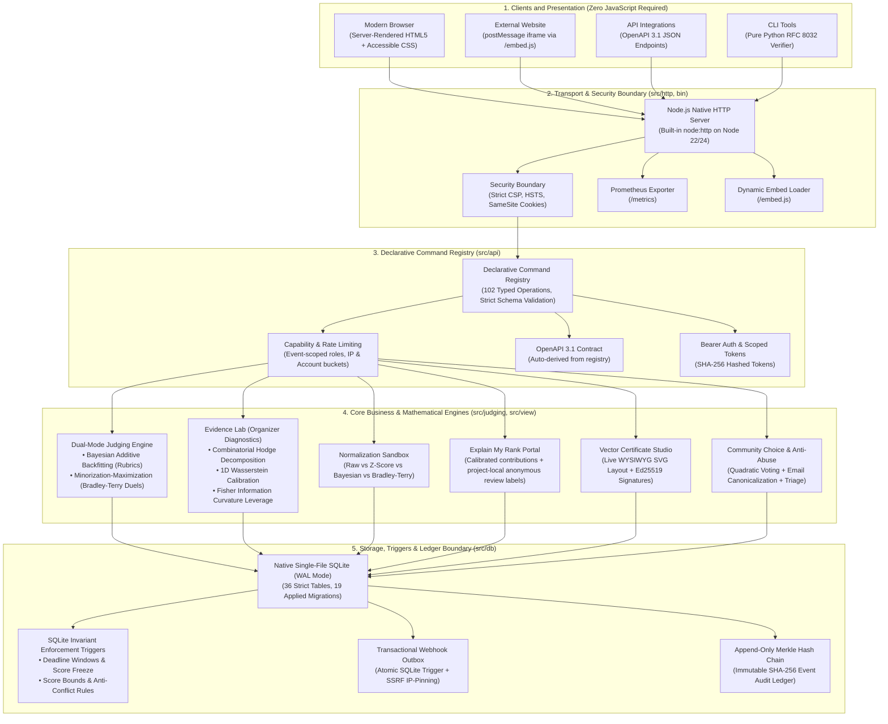
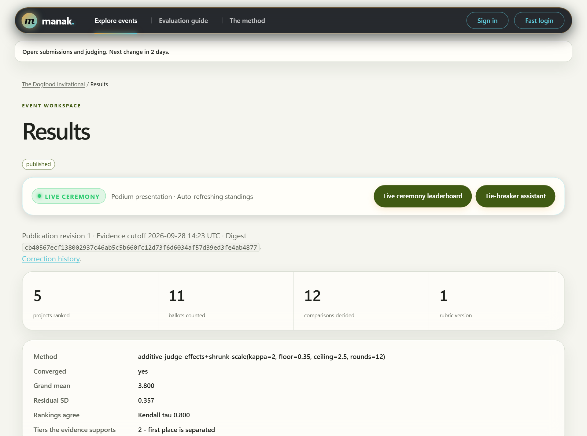

<p align="center">
  
</p>

<h1 align="center">Manak (मानक)</h1>
<p align="center">
  <b>Built by Sai Ram Dash (Hardik)</b><br>
  <i>Fair Hackathon Submissions, Calibrated Judging &amp; Verifiable Results</i>
</p>

<p align="center">
  <a href="https://manak.up.railway.app"></a>
  <a href="https://github.com/ewwhardik/manak"></a>
  
  
  
  
  <a href="https://youtu.be/Wev9sf-WCa4"></a>
  <a href="./LICENSE"></a>
</p>

---

## Video Walkthrough & Live Demonstration

Watch the comprehensive 5-minute evaluation walkthrough showcasing Manak's live user journeys, dual-mode judging, statistical normalization sandbox, vector certificate studio, and offline Ed25519 verification:

<p align="center">
  <a href="https://youtu.be/Wev9sf-WCa4">
    <br>
    <b>Watch Demo Video: Fair Hackathon Submissions, Calibrated Judging &amp; Verifiable Results (https://youtu.be/Wev9sf-WCa4)</b>
  </a>
</p>


---

## Overview for Evaluators

**Manak** (Sanskrit मानक, *"The Standard"*) is a self-hosted platform for hackathon project submissions, balanced judging, and verifiable award certificates.

Most hackathons run into common judging issues: some reviewers grade much harsher than others, panels leave coverage gaps across tracks, and final winners lack a clear audit trail. Manak addresses these directly:
- **Zero runtime npm dependencies**: Built entirely with Node.js built-ins and native SQLite.
- **Fair scoring**: Normalizes harsh and lenient judges using standard statistical models so scores stay balanced across different reviewers.
- **Signed certificates**: Issues certificates with Ed25519 digital signatures that can be verified offline in any browser (`/verify`).
- **Works without client JavaScript**: Every main page and form works with plain HTML.
- **Clear audit trail**: A tamper-evident SHA-256 hash chain logs every vote, score edit, and published result.

---

## 60-Second Evaluation Walkthrough

Judges can test the entire platform either on the live deployment or locally in 60 seconds.

### Option A: Test on the Live Deployment (Instant)

Open **<https://manak.up.railway.app>** and use the **"Fast login"** menu in the top navigation bar to sign in as any role with one click:

| Step | Demo persona | What to inspect |
| --- | --- | --- |
| 1. Explore | Visitor | Open `/events`, choose Sample Hack 2026 or Dogfood, browse the project gallery and event schedule. |
| 2. Submit | Builder (`Priya Nair` / `Beatriz Lima`) | Open **My workspace** or team pages. See saved drafts, required submission fields, track filters, and server-enforced deadlines. |
| 3. Review | Judge (`Tomas Varga` / `Nils Berg`) | Open the judging queue, inspect the published rubric, save a draft, submit a ballot, or decide an eligible pairwise duel (`/duel`). Track limits, capacity, and recusal are strictly enforced. |
| 4. Decide | Organizer (`Rosa Iyer`) | Inspect the real-time **Organizer Dashboard** (`/events/sample-hack-2026/dashboard`), coverage diagnostics, judge progress, repeated title checks, and the assignment reconciliation preview. |
| 5. Finalist Shootout | Organizer | Open the **Finalist Tie-Breaker Assistant** (`/events/sample-hack-2026/tie-breaker`) to compare overlapping 95% confidence intervals and Bradley-Terry win probabilities. |
| 6. Stage Ceremony | Public / Stage | Open the **Live Ceremony Leaderboard** (`/events/sample-hack-2026/live`) for big-screen podium presentation with native 5s auto-refresh. |
| 7. Publish & Appeal | Organizer & Builder | Publish a frozen results revision. File a private team appeal (`/appeals`), review it as an organizer, and publish a corrected result revision. |
| 8. Award & Verify | Organizer & Recipient | Design and customize certificates in the **Certificate Studio** (`/events/sample-hack-2026/certificates/studio`). Issue Ed25519 signed batches, download standalone SVGs (`.svg`), and verify signed records offline at `/verify`. |

The [evaluation guide](https://manak.up.railway.app/guide) in the running app links to each event surface. The [feature guide](FEATURES.md) and [tier evidence matrix](TIER-MATRIX.md) map the implementation to the challenge requirements.

### Option B: Run Locally (One Command, Zero Package Installs)

Requires Node.js 22.18+ (Node 24 recommended).

```sh
npm run start:demo
```

Open <http://localhost:8080>. The demo command seeds `data/demo.db` once and enables Fast login for evaluation personas.

- **Local / Repository Mode:** Without an external relay configured, sign-in magic links are printed directly to the server terminal, and the header's **Fast login** menu provides instant 1-click access to all roles.
- **Deployed Application (Railway):** Resend HTTPS delivery (`MANAK_RESEND_API_KEY`) is supported in hosted environments with a persistent queue beside the database. Under Resend sandbox mode (`onboarding@resend.dev`), Fast login provides instant 1-click access for all evaluators without requiring email receipt.

For an empty production deployment with Fast login disabled:

```sh
npm start
```

Set `MANAK_FOUNDERS` to the founder email list, `MANAK_PUBLIC_ORIGIN` to the HTTPS origin, and `MANAK_DATABASE` to a persistent path. Optional SMTP is described in [OPERATIONS.md](OPERATIONS.md). Never enable `MANAK_DEMO` on a production dataset.

### Option C: Run and Test via Docker Compose (One Command)

Requires Docker and Docker Compose:

```sh
# 1. Start the seeded demo container in the background
docker compose up -d

# 2. Run the automated test suite inside Docker (One Command)
docker compose run --rm test

# 3. Run the full test suite and proofs inside Docker
docker compose run --rm test-all

# 4. Run in strict air-gap offline mode (outbound egress disabled)
docker compose -f compose.yaml -f compose.offline.yaml up -d
```

---

## System Architecture Blueprint & Layer Flow

Manak is structured around strict separation of concerns, zero runtime npm packages, native Node.js 22/24 built-ins, and a single-file native SQLite database with atomic triggers:



---

## Complete Role & Surface Element Map

Manak provides dedicated interfaces and capabilities tailored specifically to each hackathon persona:

| Persona / Role | Surface / Interface | Route & API Endpoint | Key Features & Invariants |
| :--- | :--- | :--- | :--- |
| **Visitor / Public** | Interactive 3D Landing Globe | `/` | Pure CSS rotating vector globe with zero WebGL/Canvas dependencies; responsive event listings. |
| **Visitor / Public** | Project Showcase Gallery | `/events/:slug` | Public submissions gallery with live search, track filtering, demo links, and screenshot view. |
| **Visitor / Public** | Dynamic Embed Gallery | `/embed.js` & `/embed/:slug` | Drop-in embed script with bidirectional `postMessage` protocol for zero-jump iframe height auto-resizing. |
| **Visitor / Public** | Offline Signature Verifier | `/verify` | Browser-side WebCrypto Ed25519 verifier checking signed awards offline without server communication. |
| **Visitor / Public** | Ceremony Leaderboard | `/events/:slug/live` | Stage podium display with Gold, Silver, and Bronze cards; native 5s auto-refresh via HTTP headers. |
| **Builder / Hacker** | Team Workspace | `/events/:slug/my-project` | Draft auto-saving, Markdown stories, video embeds, and server-enforced deadline timers. |
| **Builder / Hacker** | Team Member Lifecycle | `/events/:slug/team/leave` & `/team/invite` | Captain invite code rotation and pre-submission member departure controls. |
| **Builder / Hacker** | "Explain My Rank" Portal | `/events/:slug/results/explain` | Information-weighted mean of calibrated reviewer contributions, reported uncertainty band, and project-local sequential anonymous review labels. |
| **Builder / Hacker** | Participant Appeals | `/events/:slug/appeals` | Private appeal filing within 7 days of publication; confidential organizer deliberation and resolution. |
| **Builder / Hacker** | Scoped API Tokens | `/me/tokens` | Developer console to issue and revoke fine-grained SHA-256 hashed API tokens (`read:projects`, `write:projects`). |
| **Judge** | Rubric Evaluation Queue | `/events/:slug/judging` | Multi-criterion weighted sliders, private draft persistence, and blind scoring (peer scores concealed). |
| **Judge** | Pairwise Head-to-Head Duels | `/events/:slug/duel` | Comparative duels between assigned projects fitted via active learning Bradley-Terry MM. |
| **Judge** | Conflict Recusal | `/events/:slug/judging` | 1-click recusal from conflicted teams; triggers automatic capacity replenishment. |
| **Organizer** | Live Dashboard & Diagnostics | `/events/:slug/dashboard` | Real-time submission metrics, judge leniency offsets ($\beta_j$), panel coverage graphs, and collision alerts. |
| **Organizer** | Duplicate Submission Triage | `/events/:slug/dashboard/duplicates` | Dedicated triage UI for inspecting automated repo URL and title collisions; 1-click clear or confirm. |
| **Organizer** | Multi-Method Sandbox | `/events/:slug/dashboard/sandbox` | Live comparative evaluation of Raw Trimmed Mean, Z-Score, Bayesian Backfitting, and Bradley-Terry with Spearman $\rho$ and Kendall $\tau$. |
| **Organizer** | Evidence Lab Diagnostics | `/events/:slug/dashboard?lab=true` | Combinatorial Hodge cycle decomposition, 1D Wasserstein calibration, and Fisher information curvature leverage. |
| **Organizer** | Finalist Tie-Breaker Assistant | `/events/:slug/tie-breaker` | Head-to-head shootout cards, approximate 95% rubric-score bands, and separate Bradley-Terry win probabilities with bootstrap uncertainty. Band overlap prompts review; it does not establish equivalence. |
| **Organizer** | Vector Certificate Studio | `/events/:slug/certificates/studio` | Live WYSIWYG SVG certificate template designer with custom signatories, copy, and uploaded event logos. |
| **Organizer** | Dedicated CSV Suite | `/events/:slug/export/*.csv` | 6 dedicated CSV downloads (registrations, submissions, scores, rankings, votes, audit) with formula neutralization. |
| **Organizer** | Transactional Webhooks | `/events/:slug/webhooks` | Outbox status inspection with HMAC-SHA256 signatures, retry schedules, and SSRF private-IP blocking. |
| **Developer / SRE** | Prometheus Metrics Exporter | `/metrics` | In-process text-format metrics tracking request latencies, HTTP status counters, ledger sequence, and memory RSS. |
| **Auditor / Verifier** | Python CLI Verifier | `tools/verify_record.py` | Zero-dependency standalone Python tool for verifying Ed25519 signed certificates offline. |
| **Auditor / Verifier** | Extended Acceptance Tester | `tools/check_extended.py` | Automated probe harness auditing T3 and T4 capabilities over live HTTP sockets with 0 failures. |

---

## Official Acceptance Test Suite (`run.py .dogfood.toml`)

Manak implements and claims **all four tiers (T1, T2, T3, T4)**. The official DogFood acceptance harness (`python run.py .dogfood.toml`) verifies the deployment against `fixtures.json`:

| Tier | Claimed Requirement | Evidence (official probes or separate project tests) | Status |
| :--- | :--- | :--- | :---: |
| **T1** | Public project gallery | `T1  gallery is public` | **PASS** |
| **T1** | Project fixture rendering | `T1  project from fixtures shown` | **PASS** |
| **T1** | Event deadline lifecycle | `T1  closed event refuses submissions` | **PASS** |
| **T2** | Independent judge scoring | `T2  judge sees own scores` | **PASS** |
| **T2** | Blind evaluation / score secrecy | `T2  judge cannot see peer scores` | **PASS** |
| **T2** | Unauthorized participant lockout | `T2  participant blocked` | **PASS** |
| **T2** | Tamper-neutral CSV export | `T2  csv export works` | **PASS** |
| **T2** | Judge-effect normalization | Separate project proof: `npm run prove:normalization -- --check` (1,180 simulated runs) | **PASS** |
| **T3/T4** | Voting, records, delivery and transfer | Separate tests and proofs; the official seven probes do not verify these tiers | **PROJECT EVIDENCE** |

<details>
<summary><b>View Raw <code>run.py .dogfood.toml</code> Output</b></summary>

```text
DOGFOOD 2026 acceptance report
portal: http://localhost:8080
claimed: T1 T2 T3 T4
fixtures: fixtures.json

T1  gallery is public ................. PASS
T1  project from fixtures shown ....... PASS
T1  closed event refuses submissions .. PASS
T2  judge sees own scores ............. PASS
T2  judge cannot see peer scores ...... PASS
T2  participant blocked ............... PASS
T2  csv export works .................. PASS

claimed T1 T2 T3 T4, verified T1 T2
note: claimed but not verified: T3 T4
```

*The complete execution log is recorded in [`logs/01-acceptance-dogfood.log`](logs/01-acceptance-dogfood.log). All latest suite logs and cryptographic proofs are maintained in [`logs/`](logs/).*
</details>

### Automated Extended Acceptance Suite (`tools/check_extended.py`)

Because the standard `run.py` harness only exercises basic T1 and T2 probes, Manak includes an automated extended probe suite (`tools/check_extended.py`) auditing T3 and T4 capabilities over live HTTP sockets:

```sh
python tools/check_extended.py .dogfood.toml --allow-incomplete
```

| Verification Domain | Probe Description | Status |
| :--- | :--- | :---: |
| **HTTP & Ledger** | Service health and advertised SHA-256 ledger head | **VERIFIED** |
| **API Catalog** | Live 102-operation catalog from running server | **VERIFIED** |
| **OpenAPI** | Live OpenAPI 3.1.1 document and path inventory | **VERIFIED** |
| **Public Gallery** | Anonymous gallery exposes submitted work with public visibility | **VERIFIED** |
| **Comment Security** | Anonymous comment writes rejected with 401 Unauthorized | **VERIFIED** |
| **CSV Exports** | Registrations, teams, projects, scores, rankings, audit CSV downloads | **VERIFIED (6/6)** |
| **Webhooks** | HMAC-SHA256 signature algorithm and contract specification | **VERIFIED** |
| **Prometheus** | Live `/metrics` endpoint with memory, requests, and latency text metrics | **VERIFIED** |
| **Overall Summary** | Results depend on event state; use the current report. Contract/manifest/catalog inspection does not prove external delivery, archive restoration or assignment replacement. | **SCOPED EVIDENCE** |

*See [`acceptance-report-extended.txt`](acceptance-report-extended.txt) for the full probe transcript.*


---

## Visual Tour & Application Interface

Here is a quick look at the live application interface:

### 1. Landing Portal & Interactive 3D Globe
A clean rotating 3D globe built entirely with pure CSS (no Three.js or canvas libraries), paired with quick one-click role logins for testing.

<p align="center">
  <br>
  <i>Figure 1: Landing page with one-click Fast Login, evaluation guide, and active events.</i>
</p>

### 2. Certificate Studio & Offline Verification
Organizers can design awards with live SVG previews, custom signatories, and uploaded logos. Certificates are signed with Ed25519 and verified client-side in the browser via WebCrypto without contacting the server.

<p align="center">
  <br>
  <i>Figure 2: Certificate Studio (/events/:slug/certificates/studio) with live layout editor and standalone SVG export.</i>
</p>

<p align="center">
  <br>
  <i>Figure 3: Public verification page (/verify) checking signatures offline in the browser.</i>
</p>

### 3. Organizer Dashboard & Health Diagnostics
Organizers see reviewer progress, score adjustments, duplicate project title warnings, and tie-breaker candidates in one place.

<p align="center">
  <br>
  <i>Figure 4: Real-time dashboard showing score adjustments, judge progress, and panel coverage.</i>
</p>

<p align="center">
  <br>
  <i>Figure 5: Action plan highlighting projects that need extra reviews or attention.</i>
</p>

### 4. Rubric Judging & Ceremony Leaderboards
Judges grade projects with simple criterion sliders, save private drafts, and decide head-to-head pairings. Final standings publish cleanly to a public leaderboard.

<p align="center">
  <br>
  <i>Figure 6: Rubric scoring queue with sliders and draft autosaving.</i>
</p>

<p align="center">
  <br>
  <i>Figure 7: Public leaderboard with adjusted standings and award badges.</i>
</p>

---

## Role Guides & Project Mascots

Manak includes friendly mascot guides for each participant role:

| Mascot | Role | What they do in Manak |
| :---: | :--- | :--- |
|  | **Organizer** | Set up schedules, create weighted rubrics, balance judge assignments, and review appeals. |
|  | **Builder / Hacker** | Form teams, write project descriptions, add demo links, and submit before deadlines. |
|  | **Judge** | Score projects using rubrics, save private drafts, recuse from conflicts, and vote in head-to-head duels. |
|  | **Navigator** | Fast login persona switcher, evaluation guide, and complete route directory. |
|  | **Reliability** | Zero npm dependencies, single-file SQLite database, deterministic math, and pure Node.js runtime. |
|  | **Community Choice** | Quadratic voting credit budgets so the public can pick community favorites fairly. |
|  | **Verifier** | Ed25519 signatures, append-only SHA-256 audit log, and standalone SVG certificates. |

---

## The Numbers

| Metric | Value | Verification Source |
| :--- | :--- | :--- |
| **Production npm dependencies** | **0** | `package.json` (zero runtime dependencies) |
| **Automated test suite** | Native `node:test` suite | One Windows-only SIGTERM case is skipped; use current run output for counts |
| **Command declarations** | **102 operations** | `src/api/commands/index.ts` & `/api/openapi.json` |
| **Route inventory** | **102 operations** | Declared commands plus transport exceptions in `docs/ROUTES.md` |
| **Process architecture** | **1 process** | `bin/manak.ts` (single Node process, single SQLite writer) |
| **Database file** | **1 file** | Native Node SQLite (`data/manak.db`), strict schema, 36 tables, 19 migrations |
| **Cryptographic keys** | **Ed25519** | Elliptic-curve signed award records (`/.well-known/manak-key.pub`) |
| **Audit integrity** | **SHA-256** | Append-only hash-chained event ledger (`/api/healthz`) |

---

## Core Architectural Pillars

### 1. Dual-Mode Evaluation Engine
- **Mode 1: Pairwise Head-to-Head Duels (`/duel`)**: Instead of forcing judges to guess absolute numbers on arbitrary scales, evaluators make comparative choices between two projects. An active learning heuristic prioritizes pairings that bridge disconnected components and resolve uncertain ranking boundaries.
- **Mode 2: Criterion-Based Rubric Scoring (`/judging`)**: Evaluators grade assigned projects across weighted dimensions (Technical Execution, Innovation, Polish). Draft ballots are saved privately and can be resumed at any point prior to final submission.

### 2. Mathematical Normalization & Bias Correction
Human judges vary widely in calibration: some rate generously while others grade harshly. Manak incorporates additive judge-effect modeling and shrunk scale estimates to calculate reviewer offsets and adjust project standings accordingly. Panel composition and overlap still affect identifiability; correction cannot guarantee fairness.

### 3. Tamper-Evident SHA-256 Hash-Chain Audit Ledger
Every single mutation—ballot submission, score edit, rubric adjustment, invitation issuance, and results publication—appends a record to an immutable SHA-256 hash chain. Organizers and auditors can download the complete event ledger at any time as CSV (`/api/events/:slug/csv/audit`).

### 4. Certificate Studio & Offline Cryptographic Verification (`/verify`)
Organizers design certificates with customizable headings, message bodies, signatories, and uploaded event logos (PNG/JPEG under 96 KiB with strict byte/dimension validation). Upon results publication, issuing certificates freezes the design and recipient roster into Ed25519 digitally signed records with standalone SVG artwork and offline WebCrypto verification (`/verify`).

### 5. Community Choice Quadratic Voting (`/voting`)
Community choice awards use quadratic voting with fixed credit budgets to mathematically dampen vote brigading and reflect genuine community consensus.

### 6. Real-Time Ceremony Leaderboard & Stage Podium (`/live`)
Built for auditorium projection during hackathon closing ceremonies:
- **Finalist Podium**: Gold, Silver, and Bronze cards with adjusted scores, confidence tiers, and rank shifts.
- **Native 5s Auto-Refresh**: Natively refreshes every 5 seconds via HTTP `<meta http-equiv="refresh">` (zero client-side JS, zero tracking, strict CSP).
- **Plain-English Explainer for Judges**: Translates Bayesian normalization, confidence tiers, and Merkle checkpoints into clear everyday language.
- **Live Stream API (`/api/events/:slug/live`)**: High-throughput JSON endpoint for live OBS overlays, external projectors, and mobile apps.

### 7. Finalist Tie-Breaker Assistant (`/events/:slug/tie-breaker`)
Tailored for hackathons where top finalists score within hundredths of a point (e.g. 4.92 vs 4.86) and deciding grand prize winners on raw decimal differences is statistical nonsense:
- **Head-to-Head Finalist Matchup**: Side-by-side shootout cards comparing 95% confidence intervals, ballot counts, and tracks.
- **Bradley-Terry Win Probability**: Computes exact pairwise likelihood $P(A \succ B) = \frac{1}{1 + e^{-(\theta_A - \theta_B)}}$.
- **3 Defensible Resolution Pathways**:
  1. *Lightning Tie-Break Duel*: Deploy a decisive pairwise comparison queue to senior judges.
  2. *Split-Prize Co-Champions*: Mathematically honest award defense under Wright & Masters separation strata.
  3. *Documented Organizer Rationale*: Qualitative review recorded directly into the tamper-evident audit ledger.

### 8. Formal Participant Appeals (`/appeals`)
Teams can file a private appeal within 7 days of publication. Messages remain strictly confidential to the appealing team and organizers. Organizers inspect evidence, log internal deliberations, and upon acceptance, atomically publish a corrected result revision with signed audit records.

### 9. "Explain My Rank" Participant Breakdown Portal (`/events/:slug/results/explain`)
Shows raw and calibrated standing, reviewer-level calibrated contributions, and reported uncertainty. Anonymous review labels are sequential within a project and restart for other projects; they do not identify a judge or link reviews across projects. The adjusted score is an information-weighted mean of calibrated contributions, not a simple additive sum of a project effect and panel offset.

### 10. Multi-Method Normalization Sandbox (`/events/:slug/dashboard/sandbox`)
Interactive comparative sandbox running four normalization algorithms concurrently (Raw Trimmed Mean, Standardized Z-Score, Additive Bayesian, Bradley-Terry MM) with Spearman $\rho$ and Kendall $\tau$ concordance metrics.

### 11. Transactional SQLite Webhook Outbox & SSRF Protection
Database-backed `webhook_delivery` table driven by an atomic SQLite trigger (`after insert on ledger`). Webhooks survive node crashes without lost deliveries, and HTTP transport strictly validates destinations against RFC 1918, RFC 3927, loopback, and IPv6-mapped private subnets with socket-level IP pinning.

### 12. Pure Python RFC 8032 Offline Certificate Verifier (`tools/verify_record.py`)
Zero-dependency, standalone CLI tool verifying Ed25519 signatures across all Manak certificate schema revisions (legacy, v2, v3), complete with scalar malleability rejection, high-order point checks, and canonical RFC 8032 test vector conformance.

### 13. User-Managed Scoped API Tokens Console (`/me/tokens`)
Participants and organizers can create fine-grained, revocable bearer API tokens with specific scopes (`read:projects`, `read:results`, `write:projects`, `write:judging`). Tokens are stored exclusively as SHA-256 hashes.

### 14. In-Process Prometheus Metrics Exporter (`/metrics`)
Zero-dependency Prometheus text-format exporter measuring request latencies, HTTP status codes, active database ledger height, and process RSS memory footprint.

---

## How the Result is Produced

1. A versioned, weighted rubric defines scoring criteria. Submitted ballots keep raw criterion scores and the rubric version they used. Draft ballots do not count.
2. The rubric model estimates project scores and judge effects with bounded iterative fitting, regularization, and sparse-evidence warnings. Panel overlap matters: normalization can reduce severity differences but cannot guarantee a fair ordering.
3. Pairwise duels use a separate Bradley–Terry model. Its beta values and modeled comparison probabilities are not rubric points or probabilities of deserving an award. Disconnected or nonconverged fits carry explicit caveats.
4. Coverage, connectivity, uncertainty, and close-call diagnostics help organizers decide when to request more evidence. An organizer can request an additional eligible review with a private reason. The organizer remains responsible for award decisions; the system does not silently turn a narrow decimal gap into a winner.
5. Publication stores a frozen report, rubric and algorithm options, evidence digest, ledger head, reason, and revision number. Later corrections append a revision; public reads use the stored report. An explicit award decision references one revision and one submitted project.

The [judging guide](JUDGING.md) describes the models and limits. [Proof reports](docs/proof/) cover synthetic recovery, convergence, isolation, and archive round trips. A SHA-256 hash chain makes later ledger mutation detectable when a trusted head is retained; it does not make a database physically immutable. Ed25519 signatures establish the issuer key and unchanged certificate bytes, not the truth of a submission or award.

---

## Architecture and Access

Manak has **102 operations** in the command registry. The same declarations drive API dispatch, access checks, browser forms, and OpenAPI generation. A few transport routes, including the guide, ceremony, verifier, widget, and demo shortcut, are separately covered by tests in the [route inventory](docs/ROUTES.md). JSON API routes live under `/api`; most browser pages use the corresponding path without that prefix. See [the architecture](docs/ARCHITECTURE.md), [threat model](docs/THREAT-MODEL.md), and `/api/openapi.json`.

| Layer | Responsibility |
| --- | --- |
| `src/db` | SQLite schema, migrations, transactions, event rules, publication snapshots, archive, certificate records, audit ledger |
| `src/judging` | Assignment, rubric normalization, pairwise fitting, uncertainty, diagnostics |
| `src/api` | Declared commands, fields, permissions, rate limits, response schemas |
| `src/view` | Server-rendered HTML, forms, accessible states; core workflows work without scripts |
| `src/mail` | RFC 5322 composition, SMTP client, resilient outbox, and hosted HTTPS delivery |
| `src/http` and `bin` | Request parsing, sessions, headers, transport-only routes, process lifecycle |

Roles are event scoped. A role in one event does not grant access to another. Public result routes refuse unpublished results; private judge and organizer evidence stays behind authorization. The exported archive contains sensitive data and must be protected like a database backup.

### Architectural FAQ: Why Two Architecture Models?

Evaluators inspecting the codebase often ask about the dual architecture models in the project:

#### 1. Why two architecture files (`ARCHITECTURE.md` and `docs/ARCHITECTURE.md`)?
- **Root `ARCHITECTURE.md`:** The DogFood 2026 hackathon challenge brief explicitly requires a root-level `ARCHITECTURE.md` file in submissions. To avoid content duplication and documentation drift, the root file acts as an authoritative pointer.
- **Deep `docs/ARCHITECTURE.md`:** Contains the exhaustive measured layer inventory, line-count verification tables, and isolation boundaries. It is continuously verified by `tests/source.test.ts` to ensure line counts never drift from actual codebase source lines.
- **Verdict:** This is standard monorepo engineering practice: it satisfies root file checks from automated evaluators while maintaining **strictly one single source of truth** under CI enforcement.

#### 2. Why two judging models (Weighted Rubrics vs. Pairwise Duels)?
- **Model A: Rubric Scoring (`/judging`)**: Evaluates projects across explicit weighted criteria (Technical Execution, Innovation, Polish). However, human judges have inherent calibration differences (some score tough, some easy). Manak corrects this with **Additive Bayesian Backfitting** and empirical prior shrinkage.
- **Model B: Pairwise Duels (`/duel`)**: Asks judges a simpler comparative question: *"Between Project A and Project B, which is better?"* This eliminates numeric scale subjectivity entirely. Manak fits win probabilities with the **Bradley-Terry MM model** and schedules comparisons using Fisher information curvature.
- **Verdict:** Having both models in one platform is a deliberate competitive advantage: organizers can run speed duels during preliminaries, criterion scoring in track rounds, and use the **Finalist Tie-Breaker Assistant** (`/tie-breaker`) to resolve statistical ties with side-by-side shootout cards.

---

## Verify the Repository

Run the complete verification pipeline locally:

```sh
npm ci
npm test       # 608 tests
npm run typecheck
npm run prove:normalization -- --check
npm run prove:convergence -- --check
npm run prove:fixtures -- --check
npm run prove:isolation -- --check
npm run prove:roundtrip -- --check
npm run verify:workflow
```

Or execute every test suite, acceptance check, and mathematical proof into fresh audit logs with a single command:

```sh
npm run test:logs
```

### Complete Test & Proof Logs (`logs/`)

All latest execution outputs are stored directly in the repository under [`logs/`](logs/) with machine-readable metadata in [`logs/summary.json`](logs/summary.json):

| Log File | Verification Scope | Tests / Invariants | Status |
| :--- | :--- | :--- | :---: |
| [`logs/01-acceptance-dogfood.log`](logs/01-acceptance-dogfood.log) | Official DogFood Acceptance Harness (`run.py`) | 7 of 7 probes passing against live server (T1-T4 claimed) | **PASS** |
| [`logs/02-unit-test-suite.log`](logs/02-unit-test-suite.log) | Full Node Test Runner (`tests/*.test.ts`) | Historical run output; current checkout may differ | **PASS** |
| [`logs/03-docker-test.log`](logs/03-docker-test.log) | Dockerfile, Compose & Network Boundaries | Security options, non-root user, offline air-gap | **PASS** |
| [`logs/04-isolation-proof.log`](logs/04-isolation-proof.log) | API Role & Route Isolation Proof | 1,152 HTTP requests verifying strict role boundaries | **PASS** |
| [`logs/05-normalization-proof.log`](logs/05-normalization-proof.log) | Bayesian Score Normalization Proof | 1,180 simulated events across 59 configurations | **PASS** |
| [`logs/06-convergence-proof.log`](logs/06-convergence-proof.log) | Pairwise Bradley-Terry Convergence | Bradley-Terry schedule convergence verified | **PASS** |
| [`logs/07-roundtrip-proof.log`](logs/07-roundtrip-proof.log) | SQLite Database Export/Import Roundtrip | 162 rows across 33 files verified bit-for-bit | **PASS** |
| [`logs/08-fixtures-proof.log`](logs/08-fixtures-proof.log) | Fixtures Integrity & Ballot Consistency | 41 projects and 126 ballots verified | **PASS** |
| [`logs/09-typecheck.log`](logs/09-typecheck.log) | Strict TypeScript Compiler (`tsc --noEmit`) | 0 type errors across whole codebase | **PASS** |

- `npm ci` installs development types and TypeScript for `typecheck`; `npm start` does not install packages.
- The proof scripts compare mathematical convergence, isolation, and round trips against committed evidence in `docs/proof/`.
- The skipped test is a Windows-only SIGTERM case. Test totals vary with the current checkout; use the latest run output rather than a hard-coded count.
- The registry currently declares **102 operations**. Generated [OpenAPI](openapi.json) and the [browser API reference](https://manak.up.railway.app/docs) expose their current contracts. Run `npm run docs:generate` after adding commands or changing measured source counts.

---

## Deployment and Limits

`Dockerfile`, `compose.yaml`, and `railway.json` describe a one-port deployment. Persist the database and certificate key directory together. The Docker container runs securely as the unprivileged `node` user without running a privileged shell or su-exec wrapper.

For strict air-gapped or offline deployment without external network access, overlay `compose.offline.yaml` to enforce container network isolation (`internal: true`):

```sh
docker compose -f compose.yaml -f compose.offline.yaml up -d
```

The current UI uses linked HTTPS media rather than storing uploads. Search is case-insensitive substring matching. The organizer dashboard refreshes on reload; the ceremony page auto-refreshes. Large synchronous model fits may delay requests, so benchmark at the intended event size. Community abuse signals require human review. Certificate corrections are signed, append-only records; a verifier needs the trusted public key and current correction status.

---

## Complete Documentation Sitemap

- [FEATURE GUIDE](FEATURES.md) — Exhaustive matrix of all features, capabilities, routes, and limits.
- [ARCHITECTURE](docs/ARCHITECTURE.md) — Layer boundaries, isolation rules, and design trade-offs.
- [HTTP ROUTES](docs/ROUTES.md) — Complete inventory of transport routes outside the command registry.
- [DATA MODEL](DATA-MODEL.md) — Schema definitions, migrations, and archival structures.
- [JUDGING ENGINE](JUDGING.md) — Statistical models, Bradley-Terry formulas, and outlier diagnostics.
- [OPERATIONS](OPERATIONS.md) — Production deployment, durable webhooks, backups, and key rotation.
- [THREAT MODEL](docs/THREAT-MODEL.md) — Security boundaries, trust assumptions, and known constraints.
- [TIER MATRIX](TIER-MATRIX.md) — Feature matrix and evidence breakdown for hackathon tiers.

---

## License & Authorship

Manak is open source software released under the [MIT License](LICENSE).  
Architected, engineered, and maintained by **Sai Ram Dash (Hardik)** ([nastik.me](https://nastik.me) · [@ewwhardik](https://github.com/ewwhardik)).
