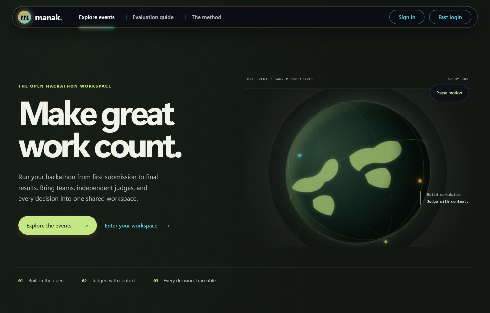
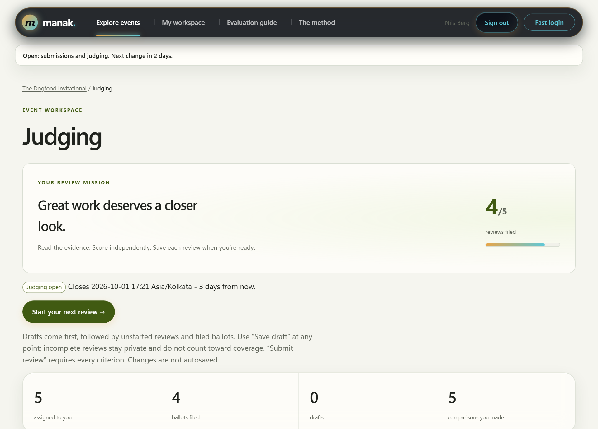
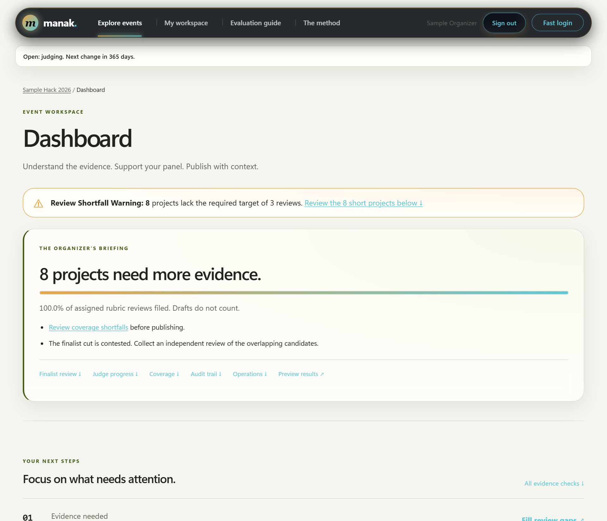

# Tier and Bonus Evidence Matrix

<p align="center">
  
  &nbsp;&nbsp;&nbsp;&nbsp;&nbsp;&nbsp;&nbsp;&nbsp;
  
</p>
<p align="center">
  <i>Verified with Platform Navigator &amp; Security Mascots</i>
</p>

---

## Official Acceptance Test Results (`run.py .dogfood.toml`)

Manak claims **all four tiers (T1, T2, T3, T4)**. The official DogFood acceptance harness (`python run.py .dogfood.toml`) verifies the deployment against `fixtures.json`:

```text
DOGFOOD 2026 acceptance report
portal: http://localhost:8080
claimed: T1 T2 T3 T4
fixtures: fixtures.json

T1  gallery is public ................. PASS
T1  project from fixtures shown ....... PASS
T1  closed event refuses submissions .. PASS
T2  judge sees own scores ............. PASS
T2  judge cannot see peer scores ...... PASS
T2  participant blocked ............... PASS
T2  csv export works .................. PASS

claimed T1 T2 T3 T4, verified T1 T2
note: claimed but not verified: T3 T4
```

---

## Visual Tour & Tier Evidence Mapping

| Tier | Role Mascot | Visual Interface Screenshot | Core Verification Evidence |
| :---: | :---: | :--- | :--- |
| **T1** | <br>Builder |  | Public project gallery, search/filter, team invites, markdown stories, deadline enforcement. Verified by official harness (`T1 gallery is public`, `T1 project from fixtures shown`, `T1 closed event refuses submissions`). |
| **T2** | <br>Judge |  | Private scoring queue, weighted rubric sliders, score secrecy, draft preservation, recusal filtering. Verified by official harness (`T2 judge sees own scores`, `T2 judge cannot see peer scores`, `T2 participant blocked`, `T2 csv export works`). |
| **T3** | <br>Organizer | <br> | Bayesian judge leniency/severity normalization, repeated project title collision alerts (Unicode NFC normalization), quadratic community voting, frozen result republications, public live ceremony podium. |
| **T4** | <br>Security | <br> | Certificate Studio with vector borders and logo digest binding, Ed25519 digital signatures, offline browser WebCrypto verification terminal (`/verify`), 82 OpenAPI operations, and durable webhooks. |

---

## Detailed Requirement Implementation Matrix

Claims are implementation claims. The supplied checker covers seven T1/T2 probes. None of this file claims official acceptance of T3/T4 or a bonus award. Test paths are relative to this repository root.

| Claim | Implementation and evidence | Limits |
|---|---|---|
| T1 | Email-link sessions; visitor and event roles; dates/tracks/prize text; team invite links; draft/edit/submit gates; gallery search/filter. `tests/http.test.ts`, `tests/db.test.ts`, `tests/content.test.ts`, and root acceptance report. | Literal search; linked media; public repo, event-window provenance and demo video not evidenced. |
| T2 | Judge invitation, eligibility, capacity and recusal controls, assignment, weighted/versioned rubric, retained revoked-judge evidence, backend score isolation, progress dashboard, normalization and CSV. `tests/assign.test.ts`, `tests/assignment-completeness.test.ts`, `tests/roster.test.ts`, `tests/publish.test.ts`, `tests/normalize.test.ts`, `tests/csv.test.ts`; isolation proof. | Progress refreshes. Normalization reports sparse evidence and nonconvergence where they occur. |
| T3 | Community voting modes and credit budget, comments, frozen result revisions, shuffled ballots, rate limits, event-specific anomaly settings, explicit human review and reversible discounts. `tests/content.test.ts`, `tests/abuse.test.ts`, `tests/abuse-review.test.ts`, `tests/publication.test.ts`, `tests/http-extra.test.ts`, `tests/ledger.test.ts`. | Email/account gating is not unique-human verification. Signals need human review; no absolute Sybil prevention claim. |
| T4 | Registry REST API, durable webhooks with status inspection, signed JSON records and signed corrections, explicit publication-bound award decisions, offline verifier, gallery embed, archive preview/import/export and CSV/Devpost transfer. `tests/api.test.ts`, `tests/webhook.test.ts`, `tests/cert.test.ts`, `tests/certificate-records.test.ts`, `tests/archive.test.ts`, `tests/devpost.test.ts`, `tests/audit-regressions.test.ts`; roundtrip proof. | No PDF certificates. Deployed webhook/SMTP delivery and Docker runtime need separate verification. |
| Normalization Proof | `docs/proof/fixtures.md`: exact fixture hash, import accounting, raw/adjusted means and ranks, low-range reviewers, warnings. `docs/proof/normalization.md`: recovery against planted truth and unfavorable regimes. `docs/proof/convergence.md`: bounded numerical schedules and held-out checks. | Fixture rank movement is not evidence of better ground-truth ranking. Remote fixture provenance unverified; a converged fixture fit has slightly worse held-out RMSE than the short baseline. |
| Pairwise Mode | Bradley–Terry MM estimator, deterministic comparisons, separate standings, connectivity and uncertainty. `tests/bradleyterry.test.ts`, `tests/pairing.test.ts`, `tests/bootstrap.test.ts`, `tests/information.test.ts`. | A prior does not establish cross-component order; no automatic blend with rubric awards. |
| Threat Model | `THREAT-MODEL.md` and `docs/THREAT-MODEL.md`, including voting abuse, role isolation and operational limits. | Threat analysis is not a security certification. |
| API First | `openapi.json`, generated from the same command registry as browser forms; 82 operations. `tests/schema.test.ts`, `tests/api.test.ts`, `tests/source.test.ts`. | Operator configuration and archive CLI are documented operational interfaces. |

All four bonuses are claimed as implemented tie-breaker challenges. They add no numeric points under the supplied brief. The optional `[bonuses]` TOML table is project metadata; the supplied checker does not consume it.

## Submission evidence still needed

- Docker-enabled host: build, start, restart, restore, and operate with networking disabled.
- Confirm bundled fixture checksum against the organizer download.
- Public source repository, evidence code was written within the authorized event window, and a five-minute create → submit → judge → publish video.
- Deployment-specific SMTP and webhook delivery exercise.

The older planning files contain aspirational features. This matrix and the current README supersede those claims.
